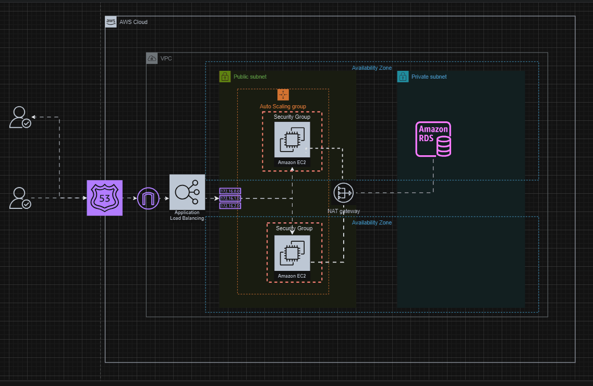

# Terraform AWS Infrastructure Project



This Terraform project provisions a comprehensive AWS infrastructure. It includes modules for a VPC, public and private subnets, a NAT gateway, security groups, EC2 instances, an Application Load Balancer (ALB), an Auto Scaling Group, an RDS instance, and Route 53 DNS management.

## Table of Contents
1. [Introduction](#introduction)
2. [Prerequisites](#prerequisites)
3. [Project Structure](#project-structure)
4. [Modules](#modules)
    - [VPC](#vpc)
    - [Subnets](#subnets)
    - [NAT Gateway](#nat-gateway)
    - [Security Group](#security-group)
    - [EC2](#ec2)
    - [ALB](#alb)
    - [Auto Scaling Group](#auto-scaling-group)
    - [RDS](#rds)
    - [Route 53](#route-53)
5. [Usage](#usage)

## Introduction

This project uses Terraform, an Infrastructure as Code (IaC) tool, to provision and manage resources on AWS. The infrastructure includes a VPC, subnets, a NAT gateway, security groups, EC2 instances, an ALB, an Auto Scaling Group, an RDS instance, and Route 53 for DNS management.

## Prerequisites

- AWS account
- Terraform installed on your local machine
- Basic knowledge of AWS and Terraform

## Project Structure

The project is organized into modules for each component of the infrastructure. Each module includes the Terraform configuration files for that component.

```
.
├── main.tf
├── provider.tf
├── variables.tf
├── output.tf
├── modules
│ ├── vpc
│ │ ├── main.tf
│ │ ├── variables.tf
│ │ └── output.tf
│ ├── subnet
│ │ ├── main.tf
│ │ ├── variables.tf
│ │ └── output.tf
│ ├── nat_gateway
│ │ ├── main.tf
│ │ ├── variables.tf
│ │ └── output.tf
│ ├── security_group
│ │ ├── main.tf
│ │ ├── variables.tf
│ │ └── output.tf
│ ├── ec2
│ │ ├── main.tf
│ │ ├── variables.tf
│ │ └── output.tf
│ ├── alb
│ │ ├── main.tf
│ │ ├── variables.tf
│ │ └── output.tf
│ ├── autoscaling_group
│ │ ├── main.tf
│ │ ├── variables.tf
│ │ └── output.tf
│ ├── rds
│ │ ├── main.tf
│ │ ├── variables.tf
│ │ └── output.tf
│ └── route53
│ ├── main.tf
│ ├── variables.tf
│ └── output.tf
└── README.md
```

# Modules

## VPC

This module creates a VPC with the specified CIDR block.

- main.tf: Defines the VPC resource.
- variables.tf: Declares variables for the VPC.
- output.tf: Outputs the VPC ID.

## Subnets

This module creates both public and private subnets within the VPC.

- main.tf: Defines the subnet resources.
- variables.tf: Declares variables for the subnets.
- output.tf: Outputs the subnet IDs.

## NAT Gateway

This module provisions a NAT gateway in the public subnet to allow outbound internet traffic for instances in the private subnet.

- main.tf: Defines the NAT gateway and EIP resources.
- variables.tf: Declares variables for the NAT gateway.
- output.tf: Outputs the NAT gateway ID.

## Security Group

This module creates security groups to control inbound and outbound traffic for the instances.

- main.tf: Defines the security group resources.
- variables.tf: Declares variables for the security groups.
- output.tf: Outputs the security group IDs.

## EC2

This module provisions EC2 instances within the VPC and subnets.

- main.tf: Defines the EC2 instance resources.
- variables.tf: Declares variables for the EC2 instances.
- output.tf: Outputs the instance IDs.

## ALB

This module creates an Application Load Balancer to distribute incoming traffic across multiple EC2 instances.

- main.tf: Defines the ALB resources.
- variables.tf: Declares variables for the ALB.
- output.tf: Outputs the ALB DNS name.

## Auto Scaling Group

This module sets up an Auto Scaling Group to ensure the application has the right number of instances running to handle the load.

- main.tf: Defines the auto scaling resources.
- variables.tf: Declares variables for the auto scaling group.
- output.tf: Outputs the auto scaling group details.

## RDS

This module provisions an RDS instance within the private subnets for database needs.

- main.tf: Defines the RDS resources.
- variables.tf: Declares variables for the RDS instance.
- output.tf: Outputs the RDS instance details.

## Route 53

This module manages DNS records for the application using AWS Route 53.

- main.tf: Defines the Route 53 resources.
- variables.tf: Declares variables for the Route 53 setup.
- output.tf: Outputs the Route 53 record details.

# Usage

## Clone the repository

```sh
git clone https://github.com/ahmed32salama/terraform.git
cd terraform-aws-infrastructure
```
## Initialize the project
```sh
terraform init
```
## Plan the deployment
```sh
terraform plan
```
## Apply the configuration
```sh
terraform apply
```
## Destroy the infrastructure
```sh
terraform destroy
```
